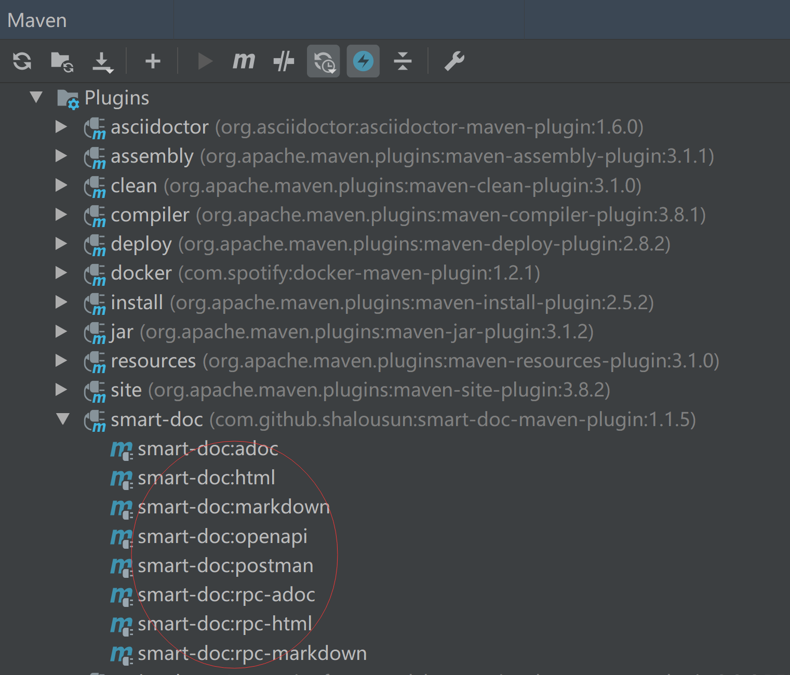
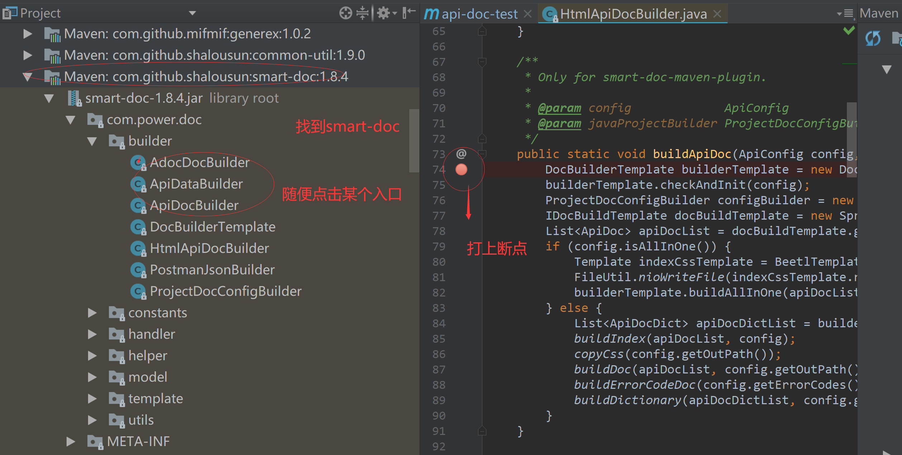
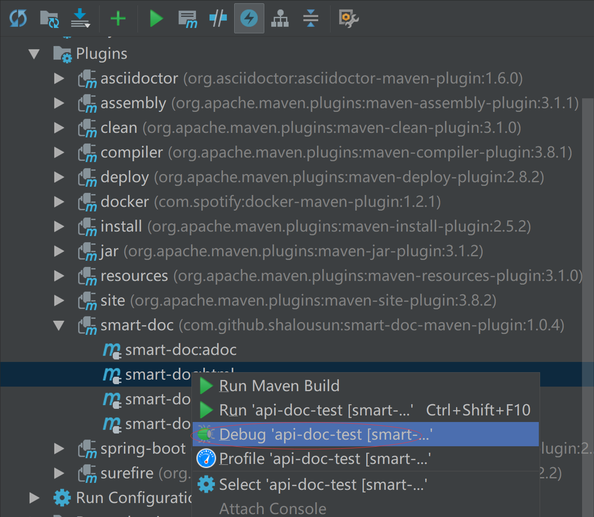

# Maven
从`smart-doc 1.7.9`开始官方提供了`Maven`插件，可以在项目中通过运行插件来直接生成文档。 

# 环境要求
- `Maven` 3.3.9+
- `JDK`1.8+

# 插件使用范围
在`smart-doc-maven-plugin 1.0.2`以前的版本，在多模块的`Maven`项目中使用插件存在着各种问题。

自`smart-doc-maven-plugin 1.0.2`插件开始，我们在插件上做了很多努力，不仅解决了插件在`Maven`多模块中存在的各种问题，
而且为`smart-doc`带来更强的源码加载能力。 在使用插件的情况下，`smart-doc`的文档分析能力增强的很多。

`smart-doc-maven-plugin 1.0.8`开始支持`Dubbo RPC`文档生成。

也建议使用旧版本`smart-doc-maven-plugin`的用户立即升级到最新版本。后续在使用`smart-doc`时推荐采用插件的方式。

> 使用插件后就不需要在项目的`maven dependencies`中添加`smart-doc`的依赖了，直接使用插件即可。如果需要保留原有单元测试，需要引用`smart-doc`的依赖。

使用参考如下：

# 添加插件

```xml
<plugin>
    <groupId>com.ly.smart-doc</groupId>
    <artifactId>smart-doc-maven-plugin</artifactId>
    <version>[最新版本]</version>
    <configuration> 
        <configFile>./src/main/resources/smart-doc.json</configFile>  
        <projectName>${project.description}</projectName>  
        <includes>  
            <!-- 使用了mybatis-plus的Page分页需要include所使用的源码包 -->
            <include>com.baomidou:mybatis-plus-extension</include>
            <!-- 使用了mybatis-plus的IPage分页需要include mybatis-plus-core-->
            <include>com.baomidou:mybatis-plus-core</include>
            <!-- 使用了jpa的分页需要include所使用的源码包 -->
            <include>org.springframework.data:spring-data-commons</include>             
        </includes> 
    </configuration>
    <executions>
        <execution>
            <!--如果不需要在执行编译时启动smart-doc，则将phase注释掉-->
            <phase>compile</phase>
            <goals>
                <!--smart-doc提供了html、openapi、markdown等goal，可按需配置-->
                <goal>html</goal>
            </goals>
        </execution>
    </executions>
</plugin>
```
## 插件 configuration
### configFile
指定生成文档的使用的配置文件。相对路径时请用./开头，eg: `./src/main/resources/smart-doc.json`

### projectName
指定项目名称，推荐使用动态参数，例如${project.description}。

2.3.4开始, 如果smart-doc.json中和此处都未设置projectName，插件自动设置为pom中的projectName

### excludes & includes

#### 加载源码机制
smart-doc会自动分析依赖树加载所有依赖源码，不过这样会存在两个问题：
1. 加载不需要的源码，影响文档构建效率
2. 某些不需要的依赖加载不到时，会报错（smart-doc默认所有的依赖都是必须的）
   
 
#### 依赖匹配规则
1. 匹配单个依赖： `groupId:artifactId`
2. 正则匹配多个依赖： `groupId:.*`


#### includes
使用includes，按需加载依赖，减少不必要的依赖解析。

通常我们需要的依赖就除了几个常见的三方库，就是公司内部的二方库，和项目中的其他模块。

 
```xml
<includes>
    <!-- 使用了mybatis-plus的Page分页需要include所使用的源码包 -->
    <include>com.baomidou:mybatis-plus-extension</include>
    <!-- 使用了mybatis-plus的IPage分页需要include mybatis-plus-core-->
    <include>com.baomidou:mybatis-plus-core</include>
    <!-- 使用了jpa的分页需要include所使用的源码包 -->
    <include>org.springframework.data:spring-data-commons</include>
</includes>
```

```xml
<includes>
      <!--加载groupId为com.xxx的所有依赖-->
      <include>com.xxx:.*</include>
<includes>
```


#### excludes

在运行插件时，遇到某些Class无法加载的情况，将该Class所在的依赖排除。

```xml
<exclude>
     <!-排除mongodb依赖-->
     <exclude>org.springframework.boot:spring-boot-mongodb</exclude>
<exclude>
```

####  excludes & includes 最佳实践
1. 要使用include，加载需要的源码，如果不需要别的依赖，可以写项目自身的 `groupId:artifactId`

2. 遇到报错后，使用excludes排除报错依赖
 


# 添加smart-doc生成文档的配置
在项目中添加创建一个`smart-doc.json`配置文件，插件读取这个配置来生成项目的文档，
这个配置内容实际上就是以前采用单元测试编写的`ApiConfig`转成`json`后的结果，因此关于配置项说明可以参考原来单元测试的配置。

**最小配置单元：**
```
{
   "outPath": "D://md2" //指定文档的输出路径
}
```

详细配置请参考具体文档(**定制化 | 配置项**)

上面的`json`配置实例中只有`"outPath"`是必填项。其它的配置根据自身项目需要来配置。

**注意：** 对于老用户完全可以通过`Fastjson`或者是`Gson`库将`ApiConfig`转化成`json`配置。
# 运行插件生成文档
## 5.1 使用maven命令行
```
//生成html
mvn -Dfile.encoding=UTF-8 smart-doc:html
//生成markdown
mvn -Dfile.encoding=UTF-8 smart-doc:markdown
//生成adoc
mvn -Dfile.encoding=UTF-8 smart-doc:adoc
//生成postman json数据
mvn -Dfile.encoding=UTF-8 smart-doc:postman
// 生成 Open Api 3.0+,Since smart-doc-maven-plugin 1.1.5
mvn -Dfile.encoding=UTF-8 smart-doc:openapi
// 生成文档推送到Torna平台
mvn -Dfile.encoding=UTF-8 smart-doc:torna-rest

// Apache Dubbo RPC文档
// Generate html
mvn -Dfile.encoding=UTF-8 smart-doc:rpc-html
// Generate markdown
mvn -Dfile.encoding=UTF-8 smart-doc:rpc-markdown
// Generate adoc
mvn -Dfile.encoding=UTF-8 smart-doc:rpc-adoc

// 生成dubbo接口文档推送到torna
mvn -Dfile.encoding=UTF-8 smart-doc:torna-rpc
```
在使用`mvn`命令构建时如果想查看`debug`日志，`debug`日志也能够帮助你去分析`smart-doc-maven`插件的源码加载情况，可以加一个`-X`参数。例如：
```
mvn -X -Dfile.encoding=UTF-8 smart-doc:html
```

**注意：** 尤其在`window`系统下，如果实际使用`mvn`命令行执行文档生成，可能会出现乱码，因此需要在执行时指定`-Dfile.encoding=UTF-8`。

查看`maven`的编码
```
# mvn -version
Apache Maven 3.3.3 (7994120775791599e205a5524ec3e0dfe41d4a06; 2015-04-22T19:57:37+08:00)
Maven home: D:\ProgramFiles\maven\bin\..
Java version: 1.8.0_191, vendor: Oracle Corporation
Java home: D:\ProgramFiles\Java\jdk1.8.0_191\jre
Default locale: zh_CN, platform encoding: GBK
OS name: "windows 10", version: "10.0", arch: "amd64", family: "dos"
```
## 5.2 在`IDEA`中生成文档


## 插件源码
[smart-doc的maven插件源代码](https://gitee.com/smart-doc-team/smart-doc-maven-plugin)

# 插件调试
在使用`smart-doc-maven-plugin`插件来构建生成`API`文档的过程中可能会出现一些错误问题。
如果一些复杂问题出现时仅仅是粗略的将错误信息放在提到`issue`中，
官方并不能根据这些简单的错误信息来解决问题，因为用户的使用环境和所写的代码都是我们无法模拟的。
因此我们希望使用`smart-doc-maven-plugin`的用户在报错时能够通过`debug`来获取到更详细的信息。
在提`issue`时添加详细的问题描述，这样也能帮助我们更加快速的修改问题。
下面将介绍如何来调试`smart-doc-maven-plugin`插件。

# 添加smart-doc依赖
因为`smart-doc-maven-plugin`最终是使用`smart-doc`来完成项目的源码分析和文档生成的，
通常情况下真正的调试的代码是`smart-doc`。但这个过程主要通过`smart-doc-maven-plugin`来排查。

```
<dependency>
     <groupId>com.ly.smart-doc</groupId>
     <artifactId>smart-doc</artifactId>
     <version>[最新版本]</version>
     <scope>test</scope>
</dependency>
```
**注意：** 使用`smart-doc`的版本最好和插件依赖的`smart-doc`版本一致。

# 添加断点
添加断点如图所示


# Debug模式运行构建目标
`maven`插件在`idea`中运行`debug`非常简单，操作如下图。

这样就可以直接进入断点了。

**提示：** 上面是通过插件去作为入口调试`smart-doc`的源码，如果你想调试插件本身的源码执行过程，则将插件的依赖添加到项目依赖中,如下：

```
<dependency>
    <groupId>com.ly.smart-doc</groupId>
    <artifactId>smart-doc-maven-plugin</artifactId>
    <version>【maven仓库最新版本】</version>
</dependency>
```
然后通过上面
的类似步骤调试`smart-doc-maven-plugin`的源码